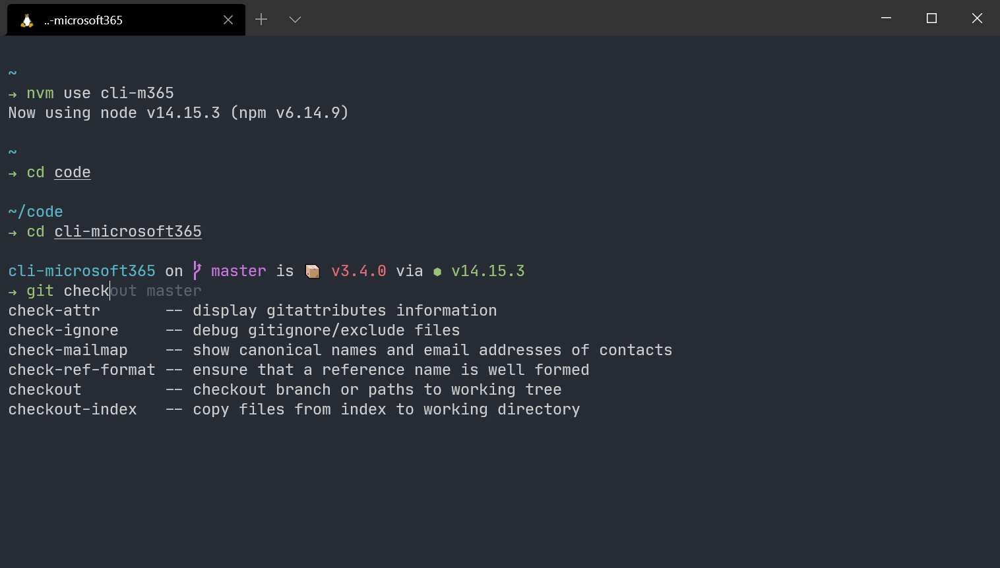

Customising your terminal is nothing new 



## Font

I like a good font that is easy to read, my current preference is [JetBrains Mono](https://www.jetbrains.com/lp/mono/#how-to-install).

## Windows Subsystem for Linux (WSL) 2

The WSL 2 is a game changer for development on Windows, it give Windows based developers the ability to interact with a running Linux operating system and benefit from the improved filesystem performance in Windows. 

It's particularly useful for SharePoint Framework (SFPx) development which uses an open source technology stack.

I'm currently running Ubuntu 20.04 LTS which I installed from Microsoft Store after [installing WSL on Windows 10](https://docs.microsoft.com/en-us/windows/wsl/install-win10).

## Shell

I use [oh my zsh](https://ohmyz.sh/) as my preferred shell, it builds on the `zsh` shell, simplifying configuration and providing a huge ecosystem of themes and plugins.

Run the script at the command line and follow the instructions to download and install.

```sh
sh -c "$(curl -fsSL https://raw.github.com/ohmyzsh/ohmyzsh/master/tools/install.sh)"
```

## Shell Theme

I absolutely love the [spaceship-prompt](https://denysdovhan.com/spaceship-prompt/) design, it's simple and clean.

Run the script at the command line to download and install.

```sh
git clone https://github.com/denysdovhan/spaceship-prompt.git "$ZSH_CUSTOM/themes/spaceship-prompt" --depth=1
ln -s "$ZSH_CUSTOM/themes/spaceship-prompt/spaceship.zsh-theme" "$ZSH_CUSTOM/themes/spaceship.zsh-theme"
```

Set `ZSH_THEME="spaceship"` in your `.zshrc` to apply it as the default shell theme.

Add `SPACESHIP_PROMPT_ORDER` to your `.zshrc` above `source $ZSH/oh-my-zsh.sh` line. 

This array enables you to define which extensions are enabled or disabled, this can be based on preference and performance, the less extensions are loaded the faster the shell will load, so I've disabled things I don't use for that reason.

```sh
SPACESHIP_PROMPT_ORDER=(
  dir           # Current directory section
  git           # Git section (git_branch + git_status)
  package       # Package version
  node          # Node.js section
  dotnet        # .NET section
  ruby          # Ruby section
  exec_time     # Execution time
  line_sep      # Line break
  battery       # Battery level and status
  jobs          # Background jobs indicator
  exit_code     # Exit code section
  char          # Prompt character
  # time        # Time stamps section
  # user        # Username section
  # host        # Hostname section
  # hg          # Mercurial section (hg_branch  + hg_status)
  # elixir      # Elixir section
  # xcode       # Xcode section
  # swift       # Swift section
  # golang      # Go section
  # php         # PHP section
  # rust        # Rust section
  # haskell     # Haskell Stack section
  # julia       # Julia section
  # docker      # Docker section
  # aws         # Amazon Web Services section
  # gcloud      # Google Cloud Platform section
  # venv        # virtualenv section
  # conda       # conda virtualenv section
  # pyenv       # Pyenv section
  # ember       # Ember.js section
  # kubectl     # Kubectl context section
  # terraform   # Terraform workspace section
  # vi_mode     # Vi-mode indicator
)
```

## Shell Plugins

These plugins help me be more productive on the command line, they are useful for providing command aliases, highlighting and completions. 

### git

This plugin comes part of the `oh-my-zsh` install, so doesn't need any configuration, it adds `git` [aliases](https://github.com/ohmyzsh/ohmyzsh/tree/master/plugins/git#aliases) and some useful functions to help make you more productive on the command line.

### zsh-syntax-highlighting

This plugin enables highlighting of commands whilst they are typed at the command line, this helps in reviewing commands before running them, particularly in catching syntax errors.

Run the script at the command line to download.

```sh
git clone https://github.com/zsh-users/zsh-syntax-highlighting.git ${ZSH_CUSTOM:-~/.oh-my-zsh/custom}/plugins/zsh-syntax-highlighting
```

Add `zsh-syntax-highlighting` to the end of your plugins array in `.zshrc`.

```sh
plugins=(git zsh-syntax-highlighting)
```

Load the plugin in your terminal.

```sh
source ~/.zshrc
```

### zsh-autosuggestions

This plugin suggests commands as you type based on your previous history and completions.

Run the script at the command line to download.

```
git clone https://github.com/zsh-users/zsh-autosuggestions ${ZSH_CUSTOM:-~/.oh-my-zsh/custom}/plugins/zsh-autosuggestions
```

Add `zsh-autosuggestions` to your plugins array in `.zshrc`.

```sh
plugins=(git zsh-autosuggestions zsh-syntax-highlighting)
```

Load the plugin in your terminal

```sh
source ~/.zshrc
```

## Node Version Manager (NVM)

[nvm](https://github.com/nvm-sh/nvm) is a version manager for node.js it enables you to install multiple installations of `node` installed on a single system and it makes switching between them really easy.

Run the script at the command line to download and install.

```sh
curl -o- https://raw.githubusercontent.com/nvm-sh/nvm/v0.37.2/install.sh | zsh
```

After installing nvm I need to install `node`, as I potentially have to use up to three different versions of node for `SPFx` and [CLI for Microsoft 365](https://pnp.github.io/cli-microsoft365) development, I install them all and configure an alias for each so I don't have to refer directly to the node version installed when I want to switch.

For CLI for Microsoft 365 development, I install `node@14` which is the current LTS release and set as the default alias as well as a named alias.

```sh
nvm install 14
nvm alias default 14
nvm alias cli-m365 14
```

For SharePoint Online SPFx development, I install `node@10` and create an alias.

```sh
nvm install 10
nvm alias spfx-spo 10
```

For SharePoint On Prem SPFx development, I install `node@8` and create an alias.

```sh
nvm install 8
nvm alias spfx-onprem 8
```

I can then use the aliases to switch between the different versions without needing to remember the exact versions.

```sh
nvm use cli-m365
nvm use spfx-spo
nvm use spfx-onprem
```

## Terminal

[Windows Terminal](https://docs.microsoft.com/en-us/windows/terminal) is a great open source terminal emulator from Microsoft enabling you to switch between different shells with ease and is fully customisable. 

I've configured JetBrains Mono as my default font to be used across all shells.

```json
{
    "fontFace": "JetBrains Mono",
    "fontSize": 12
}
```

I've added a new profile to create a new shell option for Ubuntu, which defines the colour scheme and starting directory path to `home` directory inside the WSL2 container. I store files inside the container rather than on Windows as you get a huge performance boost storing them in the WSL2 container.

```json
{
    "guid": "{07b52e3e-de2c-5db4-bd2d-ba144ed6c273}",
    "hidden": false,
    "name": "Ubuntu",
    "source": "Windows.Terminal.Wsl",
    "colorScheme": "Atom One Dark",
    "startingDirectory": "//wsl$/Ubuntu-20.04/home/<user>/"
}
```

I really like the `Atom One Dark` theme (I also use the same theme in VSCode), so I've added a new colour scheme.

```json
{
    "name": "Atom One Dark",
    "background": "#282C34",
    "foreground": "#CCCCCC",
    "black": "#000000",
    "blue": "#61AFEF",
    "brightBlack": "#5C6370",
    "brightBlue": "#61AFEF",
    "brightCyan": "#56B6C2",
    "brightGreen": "#98C379",
    "brightPurple": "#C678DD",
    "brightRed": "#E06C75",
    "brightWhite": "#FFFFFF",
    "brightYellow": "#D19A66",
    "cyan": "#56B6C2",
    "green": "#98C379",
    "purple": "#C678DD",
    "red": "#E06C75",
    "white": "#ABB2BF",
    "yellow": "#D19A66"
}
```
